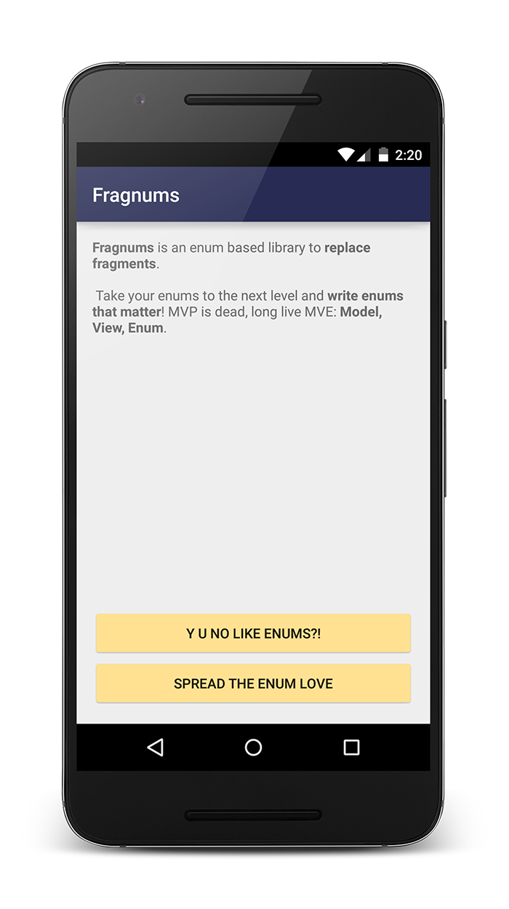
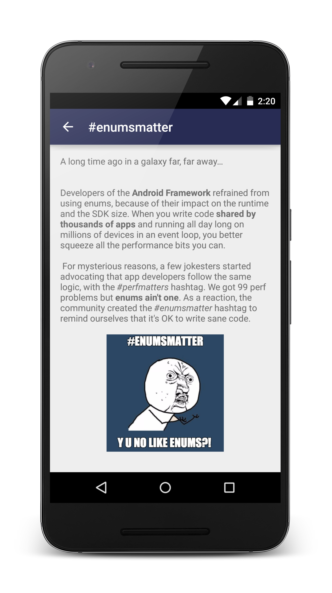
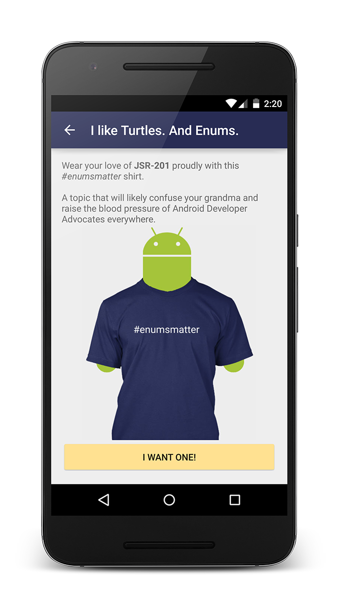

# Fragnums

An enum based library to replace fragments, because *#perfmatters*.

*“Frag your app complexity today!”* - Zach K.

We all know that [Fragments suck](https://corner.squareup.com/2014/10/advocating-against-android-fragments.html), and that [#enumsmatter](https://twitter.com/hashtag/enumsmatter). What if we could replace Fragments with Enums?

## What's Fragnums?

Fragnums is the smallest, simplest and most performant Android backstack library:

* No reflection, unlike Fragments which are recreated through reflection.
* Each enum value is both a screen and a presenter. This means only one instance of each value is created, ever. No useless garbage collection!
* Synchronous transitions coz ain't nobody got time for Async Fragment Transactions.
* Handles configuration changes, for all the landscape nut lovers out there.

## Show me the code

Creating a new screen is as simple as adding an enum value:

```java
  MY_SCREEN(R.layout.my_screen_layout, R.string.my_screen_title) {
    @Override protected void onBind() {
      View button = findViewById(R.id.button);
      button.setOnClickListener(new View.OnClickListener() {
        @Override public void onClick(View view) {
          // Do something.
        }
      });
    }
  },
```

Then you can just do `goTo(MY_SCREEN)`.

## Getting started

* Copy the [three classes](https://github.com/pyricau/fragnums/tree/master/app/src/main/java/com/example/fragnums) from the example.
* **You're good to go!** You can now focus on writing new screens and features, just by adding new enum values.

## Why should I use Fragnums?

* Ultra small footprint: no dependency. In fact, it's not even a library, just three classes to copy.
* It's really hard to test, so test zealots can't force you to write tests. You can therefore focus on writing more features.
* All your business logic is in one place, so it's really easy to have a 30,000 feet picture of your code. We suggest you start using a smaller font size in your IDE.

## How does it work?

* Nothing crazy, just [read the source](https://github.com/pyricau/fragnums/tree/master/app/src/main/java/com/example/fragnums)!

## Is this serious?

No. The core principles are good, but this is a satire library. Read the code and see for yourself.

### More details

* The suggestion that we should stop using enums because *#perfmatters* is a fallacy. An enum is essentially a class. Every new class makes our binary a bit bigger and our runtime a bit slower. Should we stop using classes? Or should we instead focus on the perf problems that actually matter?
* This library shows how to implement a very basic backstack. You don't need enums for that, you could have a `Screen` class instead.
* It's cool to know that one could make an enum centric app. However just because you can, doesn't mean you should.
* If you're into trolling at conferences, you can get the *#enumsmatter* T-Shirt [here](https://teespring.com/enumsmatter). I am not affiliated with this T-Shirt campaign.







